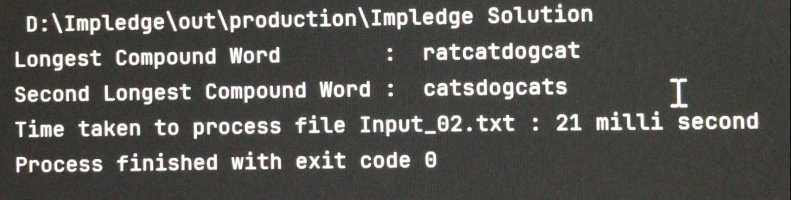
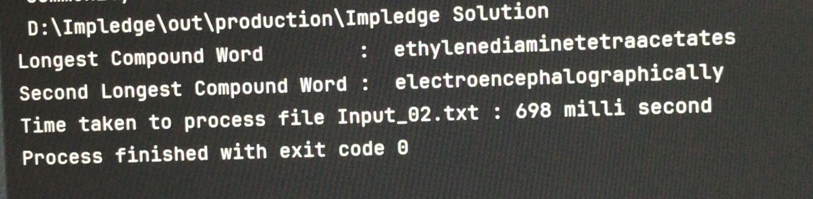

### Word Composition Problem

## Code Execution Procedure
1. Install Intellij idea community version and Choose latest version of sdk available (Open jdk 21) 
o 1.1 While installation Choose .java associations  
o Select`Update Path variable`  

 2- Open the Intellij and choose the option get from VCS
 
 3- Clone the repo using link :  https://github.com/devanshdwivedipec/Impledge.git
 
4- Open the src folder 
 
5- Open Solution.Java File 
 
6- Choose the path of file input as desired output : ~ EXAMPLE : "D:\\Solution\\src\\Input_02.txt"

### Overview

## Problem Statement 

1. Reads provided files (Input_01.txt or Input_02.txt) containing alphabetically sorted words list (one
word per line, no spaces, all lower case) 
2. Identifies & display below given data in logs/console/output file 
o `Longest` compounded word 
o `Second Longest` compounded word 
o  Time Taken to process the input file 

## Approch 
After studying the problem i went with the solution using **Hashset** and **HashMap** , checking the current string is present over the array  
:->> The problem asked to make a word with 2 or more words  
:->> After Finding all the Compound words 
:->> Found the `Longest` in the list using list string length comparison so that desired output can be achieved 
:->> Now , `SecondLongest`  
:->> Finding out the Time Taken to execute the file  
:->> Printing the output 

### OUTPUT

